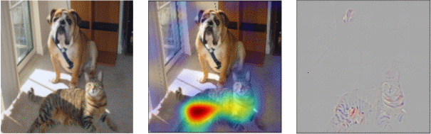

# GradCAM-keras
A keras implementation of Grad CAM as in <a href=https://arxiv.org/pdf/1610.02391.pdf><i> Grad-CAM: Visual Explanations from Deep Networks
via Gradient-based Localization </i></a>

It includes a new addition that is a separation between the positive and negative part of the image. This means that that two images will be shown one with part that represents the part that make the model selects an specific class and the parts that made the model believes it was a different class. 

The code is created to be called using command line. The help option can be used by calling:
`python gradcam.py -help`

##Bash call
A typical call is:
```
python gradcam.py -model_args_path /path/to/file.json --guided -layer_name conv2d -last_layer out
```

Command line
Call: python heatmap.py [OPTIONS]

Available options:

- -model_args_path (mandatory) -> A path with a config file that has all the information about the model and the image to analyse.
- -select_output (optional): None or an integer when there are more than one output in the model and one must be selected.
- -last_layer (optional): Empty by default. This can be used in the case that the last layer in the model is not the last layer that must be used.
                        This is not very common but if several heads are used to get the same results and then combined, this may be useful
- -layer_name (optional, default: last conv layer)-> followed by the name of the layer where the gradients will be computed for visualisation.
- -model_args_path -> Only useful when the model is not a yatima one, otherwise a config file should be expected in the folder given by image path.
- --no_pooling (optional) -> Do not average the gradient per layer. This is a variant from the method explained in the paper, where the .
- --separate_negative_positive (optional) -> Separate the visualisation between positive and negative. Two images will be shown with the regions that make the model select one class and the parts that make the image not to believe that is that class.
- --guided: This is the guided backprop explained in the paper.


##Standard input files
Example of a config file (file used in `-model_args_path`):
```
{
  "model_class": "models.model_car_color",
  "loader_method": "car_color_detector",
  "weight_path": "path/to/keras/weights/file",
  "model_inputs": [[128,128,3], 3],
  "process": "models.process",
  "process_inputs": ["/path/to/image/to/test", [128,128,3], 127.5, 127.5]
}
```

The process input may be different and it does not have any standardize format.

### Examples
